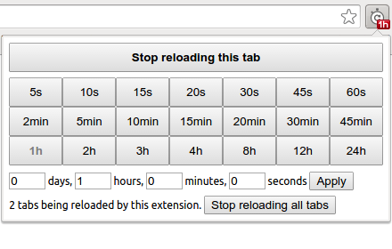

Tab auto reloader (Chrome extension)
====================================

  

This Chrome extension reloads the current tab at a chosen interval. [Get it on Chrome Web Store!][cws]

[][cws]

Features:

* Free and open-source.
* No (extra) permissions required.
* Easy-to-use.
* The reload interval can be different for each tab.

The icon is a remix of public-domain cliparts [stopwatch by
markroth8][stopwatch] and [Reload icon by mlampret][reload].

Technical stuff
---------------

### Persistent background page

This extension is implemented using a persistent background page. Ideally, it
could have been an [event page][event_pages] that only gets loaded when there
is a tab being reloaded, and gets unloaded if no tabs are being auto-reloaded.

However, I could not find a way to keep an event page active. The documentation
states that *"The event page will not shut down until all message ports are
closed."*, but keeping a global [`Port` object][port] at the background page
was not enough to prevent it from being suspended.

There is also the [alarms API][alarms], but the minimum interval is one minute,
which is unsuitable for the purposes of this extension.

If someone finds a better way to implement this extension, feel free to open
[an issue][issues] or send [a pull request][pulls].

### Icon badge and Chrome event listeners

The small text below the icon is called [badge][]. When the [badge text is
set][setBadgeText] to a single tab, the badge gets reset whenever the tab loads
another page (or reloads the same page).

For that reason, the extension adds a listener to
[`chrome.tabs.onUpdated`][onUpdated] to restore the badge text after reloading.

In addition, the extension adds a listener to
[`chrome.tabs.onRemoved`][onRemoved] to clear the reload whenever a tab gets
closed.

The extension is smart enough to remove the listeners if no tab is being
auto-reloaded.

[cws]: https://chrome.google.com/webstore/detail/knnahnemielbnanghaphjgheamgcjjcb
[issues]: https://github.com/denilsonsa/crx-reload-tab/issues
[pulls]: https://github.com/denilsonsa/crx-reload-tab/pulls
[reload]: https://openclipart.org/detail/171074/reload-icon
[stopwatch]: https://openclipart.org/detail/173421/stopwatch
[alarms]: https://developer.chrome.com/extensions/alarms
[event_pages]: https://developer.chrome.com/extensions/event_pages
[port]: https://developer.chrome.com/extensions/runtime#type-Port
[badge]: https://developer.chrome.com/extensions/browserAction#badge
[setBadgeText]: https://developer.chrome.com/extensions/browserAction#method-setBadgeText
[onUpdated]: https://developer.chrome.com/extensions/tabs#event-onUpdated
[onRemoved]: https://developer.chrome.com/extensions/tabs#event-onRemoved
